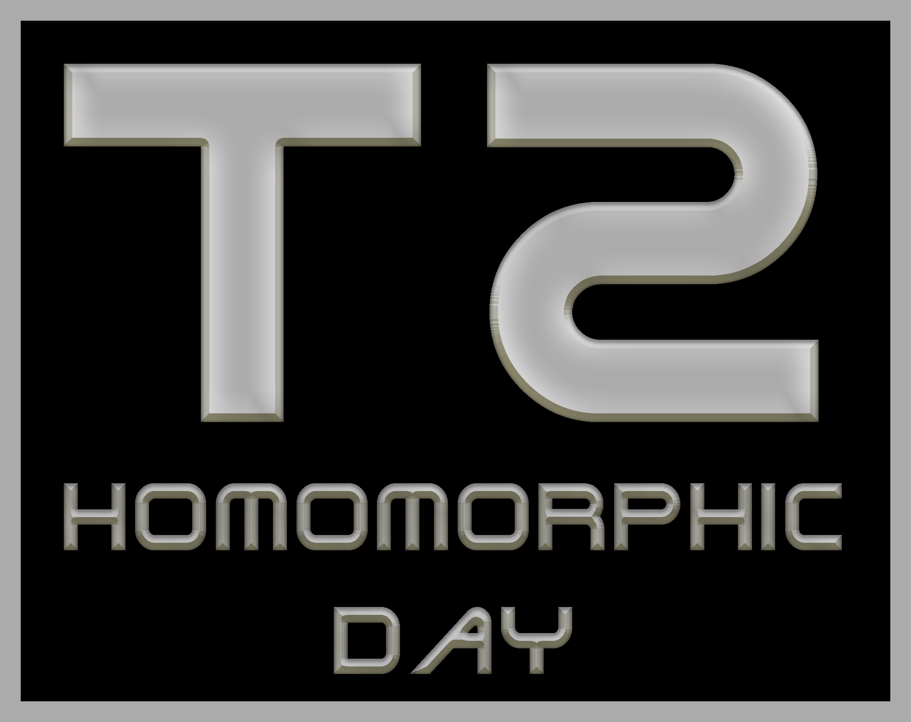
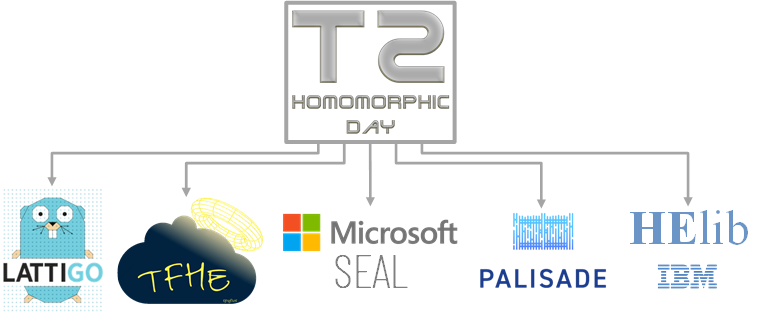

<h1 align="center">T2: A cross compiler and standardized benchmarks for FHE computation <a href="https://github.com/TrustworthyComputing/T2-FHE-Compiler-and-Benchmarks/blob/master/LICENSE"></a> </h1>

<p align="center">
    
</p>


## Overview
T2 is an *extensible cross compiler* and *standardized benchmark suite* enabling comparisons between
fully-homomorphic encryption (FHE) libraries. The T2 repository comprises the
T2 DSL and the T2 compiler from T2 DSL to state-of-the-art FHE back-ends.


T2 aims to offer a standardized benchmark suite for FHE that encompasses
realistic use-cases. Additionally, the T2 compiler offers a great starting
point to explore the different backends (e.g., HElib, Lattigo, PALISADE, SEAL,
and TFHE) as a single T2 program is effortlessly transpiled to all supported
FHE libraries.

The T2 compiler supports three distinct computational models: *Integer*, *Binary*,
and *Floating-Point* domains. Each domain utilizes different sets of functional
units, some of which are inherently supported by the backends, while others are
implemented on top of the FHE back-ends. This allows users to compare the
different domains and find the most efficient for their applications.

T2 is the spiritual successor to the [TERMinator suite
repository](https://github.com/momalab/TERMinatorSuite),
which includes benchmarks tailored to encrypted computation. The original
Terminator suite targets partially homomorphic architectures, however, since its
release, fully homomorphic encryption (FHE) has become increasingly popular and
more viable. To account for this, T2 targets FHE architectures by modifying the
original benchmarks as well as adding new additions.


### How to cite this work
The SoK outlining this framework will appear in [PoPETS
2023](https://petsymposium.org/popets/2023/) (the preprint can be accessed
[here](https://eprint.iacr.org/2022/425.pdf)). An earlier journal article describing
the original Terminator suite can be accessed
[here](https://ieeexplore.ieee.org/document/8307166), while the authors' version
is available [here](https://jimouris.github.io/publications/mouris2018terminator.pdf).
You can cite these articles as follows:

```
@Article{PoPETS:Gouert23sok,
  author =       "Charles Gouert and
                  Dimitris Mouris and
                  Nektarios Georgios Tsoutsos",
  title =        "{SoK: New Insights into Fully Homomorphic Encryption Libraries via Standardized Benchmarks}",
  volume =       2023,
  month =        Jul,
  year =         2023,
  journal =      "{Proceedings on Privacy Enhancing Technologies}",
  number =       3,
  pages =        "1--20",
}

@Article{IEEECAL:Mouris18terminator,
  author  =     "Dimitris Mouris and
                 Nektarios Georgios Tsoutsos and
                 Michail Maniatakos",
  title   =     "{TERMinator Suite: Benchmarking Privacy-Preserving Architectures}",
  journal =     "IEEE Computer Architecture Letters",
  year    =     "2018",
  volume  =     "17",
  number  =     "2",
  pages   =     "122-125",
  doi     =     "10.1109/LCA.2018.281281"}
}
```

## Supported Homomorphic Encryption Libraries

<div style="background-color:#FFFF; color:#1A2067; border: solid #718096 4px; border-radius: 4px;">
<p>
  
  <a href="https://github.com/tuneinsight/lattigo">Lattigo</a> v4.1.0 <a href="https://github.com/tuneinsight/lattigo/commit/adf762375670e412bab261cd7ffff9ca03777ad5">adf7623</a>
  <br>
  <a href="https://github.com/homenc/HElib">HElib</a> v2.2.2 <a href="https://github.com/homenc/HElib/commit/d7be6f0dca6fa6cad2b2a0923d024ac27ce2e445">d7be6f0</a>
  <br>
  <a href="https://gitlab.com/palisade/palisade-release/">PALISADE</a> v1.11.9 <a href="https://gitlab.com/palisade/palisade-release/-/commit/3d1f9a3f9fd389df1f8f27f286511f4f5871258b">3d1f9a3f</a>
  <br>
  <a href="https://github.com/microsoft/SEAL">Microsoft SEAL</a> v4.1.1 <a href="https://github.com/microsoft/SEAL/commit/206648d0e4634e5c61dcf9370676630268290b59">206648d</a>
  <br>
  <a href="https://github.com/tfhe/tfhe">TFHE</a> v1.0.1 <a href="https://github.com/tfhe/tfhe/commit/6297bc72d9294e6e635738deb2e8dc7e4ff8bc61">6297bc7</a>
  <br>
</p>
</div>
<br>


## Build and Run Instructions

### Building with Docker
* Build the Docker image:
  ```powershell
  docker build -t t2 .
  ```
* Run the Docker container: 
  ```powershell
  docker run --rm -i -t t2 bash
  ```

### Building from Scratch
#### Dependencies
*
  ```powershell
  apt install cmake make build-essential g++ clang autoconf javacc patchelf openjdk-8-jdk maven m4 tar lzip libfftw3-dev
  ```
* [Go-lang](https://go.dev/dl/)
* Follow and modify [clone_libs.sh](./.circleci/clone_libs.sh) and
  [build_libs.sh](./.circleci/build_libs.sh) scripts to install the FHE libraries in your custom destinations.

#### Compile the T2 compiler
```powershell
mvn initialize package
```

To skip running the test when compiling the T2 compiler run:
```powershell
mvn package -Dmaven.test.skip
```

## Compile T2 programs
To compile a T2 program type:
```powershell
java -jar target/terminator-compiler-1.0.jar <path_to_t2_file> [--debug] <LIB> [--w word_size]
```
where `<LIB>` can be one of `HElib`, `Lattigo`, `SEAL`, `PALISADE`, and `TFHE`. For instance:
```powershell
java -jar target/terminator-compiler-1.0.jar src/test/resources/tests/arithmetic.t2 --seal
```
will use `SEAL` as the back-end over the integers, whereas:
```powershell
java -jar target/terminator-compiler-1.0.jar src/test/resources/tests/bin_test.t2 --lattigo --w 6
```
will use `Lattigo` as the back-end in the binary domain. The T2 compiler
automatically detects the appropriate scheme (i.e., `BFV/BGV` or `CKKS`) based
on the type of the encrypted variables that the T2 program uses (i.e.,
`EncInt` or `EncDouble`).
For example:
```powershell
java -jar target/terminator-compiler-1.0.jar src/test/resources/tests/ckks_test.t2 --seal
```
will use `SEAL` with the `CKKS` scheme.


<p align="center">
    
</p>
<h4 align="center">Trustworthy Computing Group</h4>
